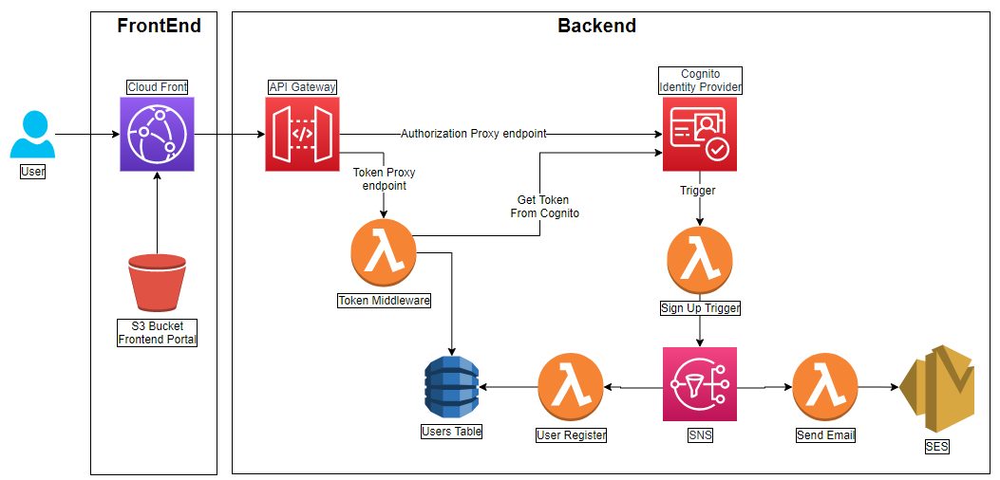

# **AWS Cloud Challenge**

The idea of this challenge is to improve development discipline AWS cloud skills by developing a simple project in multiple stages. Each stage is designed to develop some specific skills. This challenge is to be completed using AWS it may be more than one way to complete it we can provide guides but we want to allow participants to explore and choose what best suits the problem and their capabilities.

## **Stage 3**

In this stage of the Cloud Challenge, we will use what we have learned from previous stages as building blocks for a more practical functionality. All end-user facing systems require a mechanism to let new users to be enrolled and later sign in, so the goal of this stage is fully complete both a basic Sign Up and Sign in features using AWS services.

## **Architecture**

La solución se construyó con la siguiente arquitectura



### **Frontend**

Para el Frontend se usó un bucket de S3 para almacenar el contenido estático el cúal es expuesto a internet a través de CloudFront.

La URL de la aplicación es: https://dbz4u2s1scs26.cloudfront.net/index.html
Los recursos usados fueron:
* S3: cloudchallenge-webcontentbucket-y1uo5s0nrggz
* CloudFront Domain Name: dbz4u2s1scs26.cloudfront.net

El Frontend se comunicá cpn los servicios del backend a través de una API expuesta en API Gateway.

### **Backend**

Como estrategia de implementación del sistema de Autenticación y Autorización, se usó el protocolo **OpenId Connect**, el cúal a través del flujo **"Authorization Code Grant"** de OAuth2 es posible registrar y autenticar un usuario. En esta estrategia se delega a un ente externo, llamado **Identity Provider**, toda la lógica de autenticación y gestión de usuarios, estos sistemas son especializados en el manejo de forma segura la identidad de los usuarios.

Se puede usar cualquier **Identity Provider** que soporte **OpenId**, para este proyecto se usó **AWS Cognito**.

Para poder abstraer los Identity Provider se cosntruyó una capa Middleware que permite comunicarse con cualquier Identity Provider.

El punto de entrada del Backend es un AWS API Gateway, el cuál expone dos endpoints:
* **Authorize Endpoint:** https://uohsmruw86.execute-api.us-east-1.amazonaws.com/dev/oauth2/authorize
* **Token Endpoint:** https://uohsmruw86.execute-api.us-east-1.amazonaws.com/dev/oauth2/token

El **Authorize Endpoint** es un proxy hacia el endpoint /authorize de **Cognito**.

El **Token Endpoint** expone una función lambda que procesa tokens, es decir, permite obtener un token desde el Identity Provider, de esta forma los secretos del Identity Provider, access tokens y refres tokens no se exponen en el Frontend, y todo puede ser manejado desde backend.

Para manejar la personalización o flujos personalizados en la autenticación se creó una función lambda que maneja un Trigger desde Cognito, el cuál se ejecuta cunado un usuario confirma su correo electrónico al momento de registrarse, esta función Lambda coloca un mensaje en un tópico de **SNS**, el cuál distirubuye el mensaje hacia otras dos lambdas, una que hace el registro del usuario en una Base de Datos local **DynamoDB** (la palabra local se usa para diferenciar los usuarios almacenados en el Identity Provider), la otra envia un correo personalizado al usuario usando el servicio de **SES**.

```Nota 1: Aunque se sugería usar SQS para la mensajería, se decidió usar SNS porque SQS solo permite el envío de mensajes a una sola función lambda.```

```Nota 2: Aunque se sugería usar SNS para el envio de correos, se decidió usar SES porque SNS requiere que los correos que reciban los mensjaes primero deben aceptar una subscripción al topico de SNS, lo que hace dificl su utilización para el escenario planteado en el ejercició, por lo tanto, al analizar mejor el caso de uso del problema se decició usar SES.```

```Nota 3: Para probar la aplicación, primero se debe registrar el correo electronico de pruebas en SES, en la sección SES/Email Address/Verify a New Email Address```

Los recursos usados en la arquitectura anterior fueron:

* **API Gateway:** Challenge AWS Proxy
* **Cognito User Pool:** cloudchallenge
* **Token Middleware Lambda Function:** challenge-cloud-2
* **Sign Up Trigger Lambda Function:** challenge-cloud-cognito-trigger
* **SNS Topic:** challenge-cloud-sns-1
* **User Register Lambda:** challenge-cloud-register-user
* **Send Email Lambda:** challenge-cloud-email
* **User Table Dynamo:** Challenge_Cloud_Users